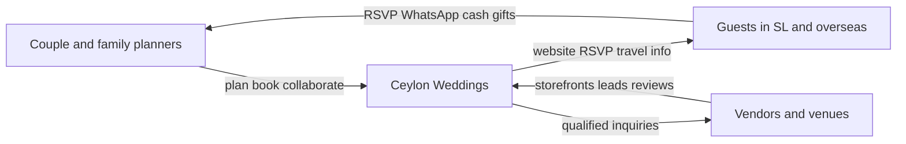
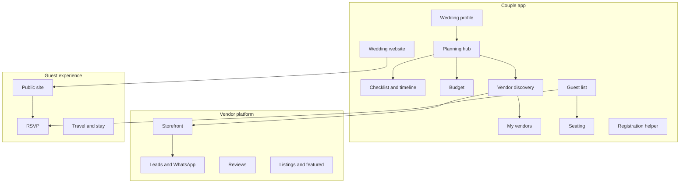

# Ceylon Weddings: Core Modules (Sri Lanka First)

The Knot is not one app. It is a **free couple OS** that feeds a **paid vendor marketplace**, plus guest-facing websites, commerce (registry/invites), and editorial. Ceylon Weddings should copy that **system**, not the US feature list.

Existing local sites ([planawedding.lk](https://planawedding.lk/), [planmywedding.lk](https://planmywedding.lk/), [nevesta.lk](https://nevesta.lk/), [ceylonweddings.com](https://ceylonweddings.com/)) cover pieces. None yet combine The Knot’s full loop: personalized planning + trusted vendor discovery + guest communication, localized to Sri Lankan rituals, family planning, WhatsApp, and large guest lists.

---

## What The Knot actually is

**Couple-facing (free, acquisition engine)**

- Date-sorted **checklist** and reminders
- Location-aware **budget** with local cost benchmarks
- **Vendor marketplace**: search, filters, reviews, photos, inquire/book
- **Wedding website** + **guest list / RSVP** (syncs both ways)
- **Registry** (retail + cash funds) and **stationery** shop
- **Style quiz / inspiration boards**
- Partner sharing, countdown, in-app vendor messaging
- Trust layer: verified reviews, Best of Weddings, Peace of Mind (vendor-cancel backup)

**Vendor-facing (revenue engine)**

- Paid storefronts, lead inbox, analytics, awards, Pro education
- Model: couples free, vendors pay for visibility (listings, featured placement, email)

**Do not copy blindly for Sri Lanka**

- US registry / Venmo cash funds (cash envelopes dominate here)
- Paper-invitation commerce as a core loop
- Single-ceremony, couple-only planning
- Email-first RSVP and US state/city geography
- English-only, USD-only

---

## Sri Lanka planning realities that change the product

These are the design constraints. Modules that ignore them will feel like a US app with a Sri Lankan skin.

| Reality                                                                                                            | Product implication                                              |
| ------------------------------------------------------------------------------------------------------------------ | ---------------------------------------------------------------- |
| Weddings are **multi-event**: poruwa, church, nikah, walima, homecoming, mehndi, engagement                        | Event objects, not one “wedding day”                             |
| **Ceremony type** drives vendors and checklist: Kandyan, Western, Hindu, Muslim, Christian, fusion                 | Onboarding must pick tradition(s)                                |
| **Nekath** (auspicious time) is the day-of clock                                                                   | Timeline works backward from nekath, not a 4pm US template       |
| **Parents and relatives** often plan and pay                                                                       | Roles: couple, mother/father, planner — not just “partner login” |
| Guest lists are **large and fluid** (often 200–500+), last-minute adds expected                                    | Households, family sides, 10–15% buffer, phone/WhatsApp RSVP     |
| **WhatsApp** is the real inbox                                                                                     | Deep-link inquiries, e-invites, reminders — not email-only       |
| Cash in envelopes is the default gift                                                                              | Gift tracking, not a Western registry, for v1                    |
| Legal marriage is **civil registration** (RGD notice + 14 days or special license; 4-day residency for foreigners) | Legal checklist module                                           |
| Diaspora + destination guests need hotels, travel, currency                                                        | Multi-currency (LKR + USD/AUD/GBP), hotel blocks, bilingual site |
| Languages: English, Sinhala, Tamil                                                                                 | i18n from day one in data model, even if UI ships EN+SI first    |

**Local vendor categories The Knot does not have:** poruwa / ashtaka, astrologer, bridal dresser, Kandyan dancers / magul bera, nadaswaram & melam, jayamangala gatha, wedding cars, jewellery *hire*, marriage registrar, mehndi, halal catering, thaali / jewellery.

**Budget context (local, 2025):** typical range ~LKR 0.8M–10M+, average around LKR 2.5M; venue+catering 40–50%. Destination mid-range often USD 10k–20k. Budget tool must use **LKR plates, guest count, and city**, not US %.

---

## Core modules (product architecture)

Three products, one wedding record.

### 1. Wedding Profile and Onboarding (foundation)

Creates the wedding object everything else personalizes against.

- Couple names, photo, date (or “date TBD”), cities/districts
- **Wedding types** (multi-select): Kandyan poruwa, Western/church, Hindu, Muslim nikah + walima, homecoming, engagement, mehndi, destination
- Guest-count estimate, budget band, who is paying (couple / bride family / groom family / split)
- Roles: partner, parents, hired planner
- Audience flags: planning from Sri Lanka vs overseas; destination guests expected
- Language preference; currency display (LKR default, USD/AUD/GBP toggle)

This replaces The Knot’s “date, city, guest count, budget” with a Sri Lanka-shaped profile.

### 2. Planning Hub (dashboard)

The Knot’s “peace of mind” home.

- Countdown (or “date not set — pick from nekath / venue availability”)
- Next 5 tasks, budget used vs remaining, RSVP snapshot, unpaid vendor deposits
- Per-event status chips (Poruwa / Reception / Homecoming)
- Diaspora view: “family in Colombo can update guests; you approve vendors”

### 3. Checklist and Timeline

The Knot’s strongest couple tool. Localize the **task graph**, not just labels.

- Templates by wedding type + months-out (12 / 6 / 3 / 1 / week / day-of)
- Sinhala Buddhist extras: astrologer, poruwa, ashtaka, traditional music, jayamangala gatha, homecoming
- Hindu extras: priest, thaali, mehndi, fire ritual logistics
- Muslim extras: maulvi, mahr note, walima, halal catering
- Christian extras: church booking, banns, choir
- Shared: venue, photo/video, bridal dresser, makeup, cake, cars, invitations, registrar
- Custom tasks; assign to a person (mother, planner, photographer)
- **Day-of run-of-show** generated backward from nekath / ceremony start
- Vendor recommendations injected beside relevant tasks (The Knot pattern)

### 4. Budget

- Categories with SL weights: venue+catering, photo/video, attire+jewellery, decor, entertainment, beauty, invitations, transport, traditional services, buffer
- Multi-payer pots (bride side / groom side / couple)
- LKR primary; overseas contributors can log in USD/AUD/GBP with a locked rate or live rate
- Plate-rate math (per-guest catering is how SL venues quote)
- Link line items to a vendor + deposit/balance dates
- Later: city benchmarks (“Colombo hotel 150 guests typically…”) once you have data

### 5. Vendor Marketplace (couple discovery)

The Knot’s commercial core. This is how the product becomes a business.

**Storefront:** photos, real weddings, packages, starting price, service areas (districts), languages, religions/styles served, capacity, lead time, WhatsApp, reviews.

**Search/filters:** category, province/district/city, price band, guest capacity, indoor/outdoor, date availability (v2), “works with poruwa / church / nikah”, “destination wedding experienced”, award/verified badges.

**SL category taxonomy (v1 must-haves):**

- Venues and halls
- Photographers and videographers
- Bridal wear, groom wear, jewellery
- Hair, makeup, bridal dressers
- Florists and decorators
- Caterers (including halal / vegetarian flags)
- Cake
- Entertainment: DJ, bands, Kandyan dancers, nadaswaram, magul bera
- Poruwa and traditional ceremony services
- Astrology / nekath
- Wedding cars
- Invitations and printing
- Planners / day coordinators
- Marriage registration / officiants
- Mehndi
- Transport and guest accommodation
- Honeymoon (later)

**Inquiry flow:** short form → vendor gets in-app + **WhatsApp prefilled message**. Do not require vendors to live in a US-style inbox.

### 6. My Vendors (couple’s booked team)

- Shortlist vs inquired vs booked
- Contacts, contracts, deposits, remaining balance
- Shared notes and files (menus, floor plans)
- Day-of contact sheet export (PDF / WhatsApp)

### 7. Guest List and Households

Built for 300–500 people and two families, not a 80-person US dinner.

- Households (Mr & Mrs + children + helpers)
- Side: bride / groom / both
- Invite to **which events** (poruwa only, reception, homecoming, walima)
- Status: considering / invited / confirmed / declined / maybe / walk-in
- Meal: veg / fish / chicken / beef / halal / other
- Channel: WhatsApp / phone / printed card / overseas
- Import CSV / phone contacts
- **Buffer headcount** for last-minute family adds
- Gift/envelope received + thank-you (private, couple-only)

### 8. RSVP, e-invites, and WhatsApp

The Knot RSVP via website. In SL, older guests confirm by phone; overseas guests need a link.

- Public or private RSVP on the wedding website
- Per-event RSVP (not a single yes/no)
- WhatsApp invite: one link, Sinhala/Tamil/English message templates
- Couple or auntie can mark “confirmed by phone”
- Reminders: WhatsApp first, SMS second, email last
- Overseas: plus travel questions (arrival date, hotel, pickup)

### 9. Seating Chart

Local competitors already treat this as a differentiator ([planawedding.lk](https://planawedding.lk/)). Include in v1.5, not day one.

- Hall layouts, family-hierarchy tables, clergy/VIP, kids
- Tied to per-event guest lists
- Must stay editable until the night before (fluid lists)

### 10. Wedding Website (guest hub)

The Knot’s guest OS. Highest leverage for diaspora and destination.

- Templates with Kandyan / church / Hindu / Muslim / beach tones
- Events, map, dress code, FAQ, registry/cash note, RSVP
- Travel: airport, hotels, monsoon/weather note, 4-day residency note for destination legal weddings
- Languages: EN + SI (TA as soon as copy exists)
- Custom subdomain (`nimali-and-kasun.ceylonweddings.com`)
- Password optional

Skip US-style invitation matching commerce in v1.

### 11. Inspiration and Style (v2)

The Knot Style Quiz + real weddings. Strong SEO and vendor matching later.

- Real Sri Lankan weddings tagged by location, tradition, budget band
- Mood boards to share with decorator / dresser
- Editorial: checklists, nekath etiquette, vendor questions

Not MVP. Needed to compete with The Knot’s content flywheel.

### 12. Legal and registration helper

High-trust, uniquely local. The Knot equivalent is “marriage license by US state.”

- General vs Kandyan vs Muslim marriage tracks (different legal regimes)
- Notice of marriage, 14-day wait, special license, witnesses, fees
- Destination: 4-day residency, passports, single-status affidavit
- Document checklist + registrar vendor category
- Disclaimer: guidance, not legal advice

### 13. Vendor platform (Pro)

Revenue. Without this, the couple app is a free spreadsheet.

- Claim/create storefront, photo gallery, packages, service areas
- Lead inbox + WhatsApp click-to-chat + response-time badge
- Review collection after event date
- Calendar / booked-out dates (v2)
- Plans: free limited listing vs paid featured / city-category boost
- Analytics: profile views, WhatsApp taps, inquiries
- Later: awards (Best of Ceylon Weddings) to drive renewals — The Knot’s Best of Weddings playbook

### 14. Collaboration and family access

Critical for “Sri Lankans living overseas.”

- Invite partner, mother, planner with roles (edit guests / view budget / manage vendors)
- Activity feed: “Amma added 12 guests”; “Photographer replied on WhatsApp”
- Timezone-aware reminders

### 15. Platform foundations (not user-facing, but core)

- Auth: phone OTP + Google; WhatsApp-friendly
- i18n: EN / SI / TA
- Payments: PayHere (local vendors), Stripe or similar (diaspora vendor ads)
- Notifications: WhatsApp Business API, push, SMS
- Admin: vendor verification, abuse, featured slots
- Geography: provinces → districts → cities (not US states)

**Explicitly defer:** full Western gift registry, printed stationery shop, attire e-commerce, Peace of Mind insurance, in-app chat replacing WhatsApp, hotel-block GDS.

---

## Competitive gap (why these modules win)

- **The Knot:** unmatched planning+marketplace loop, zero SL culture, vendors, or WhatsApp.
- **planawedding.lk:** strong couple tools (seating, e-invites); marketplace still “what’s next.”
- **planmywedding.lk:** marketplace + human coordination; less of a self-serve couple OS.
- **nevesta.lk / ceylonweddings.com:** directories, not a planning OS.

Winning combination: **culture-aware checklist + WhatsApp-native vendor leads + multi-event guest list + bilingual website for overseas family.**

---

## Recommended build order

**MVP (prove the loop)**

1. Wedding profile (multi-tradition, multi-event)
2. Planning hub + localized checklist
3. Budget (LKR, multi-payer)
4. Vendor marketplace browse + storefront + WhatsApp inquiry
5. Vendor signup + basic listing
6. Guest list (households, events, sides)
7. Wedding website lite (events, FAQ, travel, RSVP link)
8. Family/partner invite
9. English + Sinhala UI strings

**v1.5**

- WhatsApp e-invites + phone-RSVP logging
- Seating
- Reviews
- Paid featured listings
- Registration/legal helper
- Nekath day-of timeline

**v2**

- Tamil, inspiration/real weddings, city cost benchmarks, vendor calendar, awards, cash-gift tracker, destination packages

---

## Out of scope until modules are agreed

No app code yet. Workspace is empty. After you confirm this map, next work is information architecture (screens per module) and a v1 data model (`Wedding`, `Event`, `GuestHousehold`, `Vendor`, `Inquiry`).