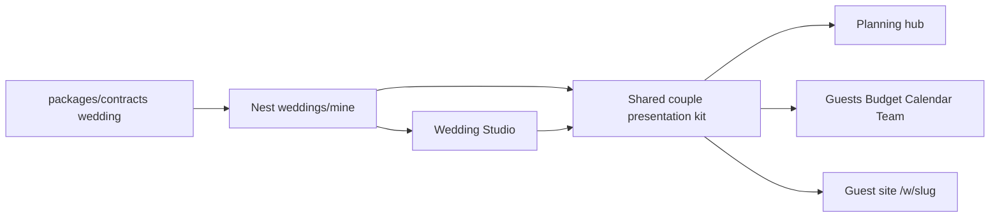

# Couple Event Studio — Contract-First Product

## Selling-point thesis

Vendors already have Offers + immersive presentation. Couples still get thin CRUD over a rich SL domain (multi-event, nekath, households, multi-payer).

> Couples: “This already feels like *our* wedding — poruwa, plates, family money, WhatsApp.”  
> Families: “Amma can run guests from Colombo while we plan from overseas.”

**Two tracks in parallel** (same playbook as [vendor_profile_creator_5de02e3c.plan.md](.cursor/plans/vendor_profile_creator_5de02e3c.plan.md)):

1. **Creator / Studio** — couples fully express the wedding object  
2. **Event ops + presentation** — same contract data renders immersively on hub, guests, budget, calendar, guest site

Creator without presentation = unused fields. Ops without contracts = page-local theater.



---

## Research gaps (what we found)

| Gap | Evidence | Fix in this plan |
|-----|----------|------------------|
| No `weddingCompleteness` | Vendor has `vendorCompleteness`; couple has none | Contract helper + attach on `mine` |
| Team lifecycle one-way | `BOOKED` enum exists; only seed writes it; no unshortlist | `PATCH/DELETE team/:vendorId` |
| Guests UI underuses API | `updateGuest` exists; page is create+list only | RSVP command center |
| Budget dates drift | Prisma `depositDueAt`/`balanceDueAt` absent from contracts/API | Expose in schemas + UI |
| Guest site under-renders | Hub uses `CoupleHero`; `/w/[slug]` is Card stack | Shared presentation kit |
| Website editor = 2 textareas | [`planning/website/page.tsx`](apps/web/src/app/[locale]/planning/website/page.tsx) | Fold into Studio + live preview |
| Hub RSVP stat wrong | Shows tasks left, not `rsvpConfirmed`/`rsvpTotal` | Hub uses presentation DTOs |
| FAMILY over-permissive | Profile/events/tasks/calendar = any membership | Couple-only for profile/events; keep existing 3 flags for guests/budget/vendors |
| Monolith contracts | [`wedding.ts`](packages/contracts/src/wedding.ts) ~830 lines mixes vendor+couple | Split modules; Zod-parse client |
| No plate / payer helpers | SL halls quote by plates; hub invents numbers | `plateSummary`, `payerRollup` in contracts |

**Explicitly out of this plan:** seating, WhatsApp Business API, PayHere, legal/RGD, mood-board CMS, activity feed, AI.

---

## Architecture rule (non-negotiable)

All product shapes and pure logic live in `@ceylonweddings/contracts`:

- Zod request/response schemas  
- Enums  
- `weddingCompleteness`, `plateSummary`, `payerRollup`, `nekathAppointmentSpecs`, `whatsappInviteUrl`, `formatWeddingDateLabel`  
- Presentation DTOs (`hubStatsSchema`, `guestListSummarySchema`, `teamBoardItemSchema`)

Nest = thin `createZodDto` + serialize to contract shapes.  
`packages/ui` domain = renderers only (no business math).  
`api.wedding.*` = `.parse()` responses like auth (at least `mine` + mutations).

---

## Track 0 — Contract foundation (ship first)

Split and deepen contracts before UI waves.

### Module layout

```
packages/contracts/src/
  common.ts                 # okResultSchema, completenessResultSchema
  wedding/
    enums.ts
    wedding.ts              # wedding, updateWeddingBody (+ locale/currency), mineWedding
    events.ts
    tasks.ts
    budget.ts               # + depositDueAt/balanceDueAt
    guests.ts               # + giftReceived/thanked writes, invite patch, delete, query, summary
    team.ts                 # shortlist, updateTeamVendorBody { status }, unshortlist
    members.ts
    appointments.ts
    access.ts
    completeness.ts         # weddingCompleteness (+ move/re-export vendor helpers later)
    public.ts
    presentation.ts         # hubStats, plateSummary types, guestListSummary
    helpers.ts              # plateSummary(), payerRollup(), nekathAppointmentSpecs(), whatsappInviteUrl()
  vendor/                   # move catalog/packages/offers/completeness out of monolith
  content/                  # articles
  index.ts                  # re-exports (no breaking import paths for apps)
```

### New / fixed contract symbols (committed)

- `weddingCompleteness(input)` → `{ score, total, ready, missing[] }` — partners, date, city, ≥1 event with `startsAt`, guest estimate, budget path, website FAQ/travel if enabled, ≥1 team link optional soft check  
- `updateTeamVendorBodySchema` `{ status: SHORTLISTED|INQUIRED|BOOKED }`  
- `okResultSchema` for deletes  
- `updateEventInviteBodySchema` `{ status }`  
- Guest create/update: `giftReceived`, `thanked`  
- Budget line schemas: `depositDueAt`, `balanceDueAt`  
- `guestListSummarySchema` / `plateSummarySchema` / `hubStatsSchema`  
- `mineWeddingSchema.completeness` optional object (mirror vendor)  
- Tighten `inquirySchema` (`preferredDate`, `vendorPhoto`) so API stops lying to the client  

### API follow-through (same foundation PR)

| Endpoint | Purpose |
|----------|---------|
| `PATCH /weddings/mine/team/:vendorId` | Set team status |
| `DELETE /weddings/mine/team/:vendorId` | Unshortlist |
| `DELETE /weddings/mine/guests/:id` | Delete household |
| `PATCH /weddings/mine/guests/:id/invites/:eventId` | Per-event RSVP |
| `DELETE` task / budget line / member | Parity deletes |
| `GET mine` | Attach `completeness` + `hubStats` / plate rollups from helpers |
| Profile/events mutations | `requireCouple` (FAMILY keeps guests/budget/vendors via flags) |

Serialize budget dates; stop returning raw Prisma for invite/inquire.

---

## Track A — Wedding Studio (creator parity)

**Route:** [`/planning/studio`](apps/web/src/app/[locale]/planning/) — sectioned studio. Redirect [`/planning/profile`](apps/web/src/app/[locale]/planning/profile/page.tsx) and [`/planning/website`](apps/web/src/app/[locale]/planning/website/page.tsx) → studio sections. Nav label: **Studio**.

Reuse [`StudioShell`](packages/ui/src/domain/creator-form.tsx) / `CreatorSectionNav` / `CompletenessChecklist` / `StickyActionBar` from Pro.

**Sections:** Basics · Style · Events · Website · Family · Publish

| Section | Content |
|---------|---------|
| Basics | Partners, date, city/district, types, guest estimate, budget/payer (if `canViewBudget`), overseas flag |
| Style | Visual `StyleStoryPicker` + palette (replace hub pills) |
| Events | `EventCeremonyCard` editor — kind, name, venue, startsAt, **nekathAt**, not raw grids |
| Website | Cover story, FAQ, travel as structured fields; share URL; enable toggle |
| Family | Invite + permission chips (existing flags) |
| Publish | Completeness checklist + “View guest site” + WhatsApp share |

**Live preview (right rail):** shared modules that also power `/w/[slug]` — `GuestSiteHero`, `CeremonySchedule`, FAQ/travel blocks, `OurTeamStrip` (BOOKED only).

Save via existing `api.wedding.update` + event CRUD; remount drafts from `mine` like storefront.

---

## Track B — Event ops (SL moat)

This is the couple equivalent of Offers — where families live.

### Guests → RSVP / plate command center

- Summary strip from `plateSummary` / `guestListSummary` (by status, side, meal, event)  
- Filters + search; upgrade [`guest-row.tsx`](packages/ui/src/domain/guest-row.tsx) with inline status, per-event invite chips, gift/thanked  
- WhatsApp invite: `whatsappInviteUrl` → `wa.me` with bilingual blurb + RSVP link  
- Phone-confirm path (auntie marks CONFIRMED without guest click)  
- Delete household; wire `updateGuest`  

### Budget → Cost Guide theater

- Unify with [`BudgetMeter`](packages/ui/src/domain/budget-meter.tsx) + `payerRollup` pots (bride / groom / couple)  
- Deposit/balance due dates; unpaid strip on hub  
- Category editor stays writable; not spreadsheet-first  

### Nekath → calendar

- From event nekath, `nekathAppointmentSpecs(event)` suggests dresser → cars → ceremony → plates blocks  
- “Generate day-of” creates `Appointment` rows; calendar shows ritual kinds with empty states + kind chips  

### Team board v2

- Group by status; mark BOOKED / remove; category gap banner (“still need photographer”)  
- Wire [`ShortlistControl`](packages/ui/src/domain/shortlist-control.tsx) as real toggle (hydrate from `mine.team`)  

### Checklist polish

- Progress + group by category; denser type templates only (no new Task domain)  
- Delete task API  

---

## Track C — Presentation (prestige loop)

Shared kit in `packages/ui/src/domain/` (apps compose; no parallel card languages):

| Module | Job | Surfaces |
|--------|-----|----------|
| `GuestSiteHero` | Full-bleed invitation plane | Guest, studio preview |
| `CoupleIdentity` | Names · date · place · style | Hub, guest, share |
| `CeremonySchedule` | Multi-event + nekath hierarchy | Guest, studio, hub |
| `PlateSummary` | Confirmed vs estimate by meal/event | Guests, hub |
| `PayerPots` | Family money story | Budget, hub |
| `RsvpSummaryStrip` | Confirmed/pending/declined | Guests, hub |
| `ShareInvitePanel` | Copy / WhatsApp / QR | Studio, hub |
| `TeamGapBanner` | Missing categories | Hub, team, catalog chrome |
| `PlanningProgress` | Completeness at a glance | Hub, studio |
| `OurTeamStrip` | Quiet BOOKED credits | Guest (evolve `GuestVendorCredit`) |
| `FaqAccordion` / `TravelGuideBlock` | Structured guest content | Guest, studio |

**Hub rebuild** ([`planning/page.tsx`](apps/web/src/app/[locale]/planning/page.tsx)): one composition — next nekath countdown, event chips, plate snapshot, payer pots (if allowed), supplier strip with status, inquiries, progress / next action. Fix RSVP stat. Soft motion only.

**Guest site rebuild** ([`w/[slug]/page.tsx`](apps/web/src/app/[locale]/w/[slug]/page.tsx)): invitation-first; same modules as studio preview. RSVP woven as branded entry, not orphan form chrome.

---

## Implementation waves

### Wave 1 — Contracts + API unlock
Split couple schemas into `wedding/*` (re-export from index); add helpers + team/guest/budget gaps; attach completeness/hubStats on `mine`; Zod-parse client; FAMILY gate on profile/events.

### Wave 2 — Wedding Studio + guest presentation kit
`/planning/studio` with live preview; redirects from profile/website; rebuild `/w/[slug]` with kit; ShareInvitePanel.

### Wave 3 — Event ops
Guests command center, budget pots + due dates, nekath→appointments, team status/unshortlist/gaps, checklist progress.

### Wave 4 — Hub composition + polish
Hub as event cockpit; quiet motion; empty states; seed demos (Nimali/Aisha/Priya) clickable end-to-end; i18n keys for new studio/ops copy (en first, si/ta follow).

---

## Success criteria

**Contracts:** Every couple mutation/response shape and plate/payer/completeness math is defined once in `@ceylonweddings/contracts`; UI does not invent totals.

**Studio:** A couple can build Kandyan+homecoming or nikah+walima and preview the guest site without touching seed — same intentional feel as Pro Offers.

**Ops:** Amma can filter guests, WhatsApp invite, phone-confirm; couple sees plate counts and unpaid deposits update.

**Presentation:** Same wedding looks premium on Studio preview → Hub → `/w/[slug]` → Our team credits.

**Selling-point test:** Diaspora relative opens guest site and understands poruwa vs homecoming; couple opens Planning and feels in control of events, plates, money, and team — not a US planner skin.
