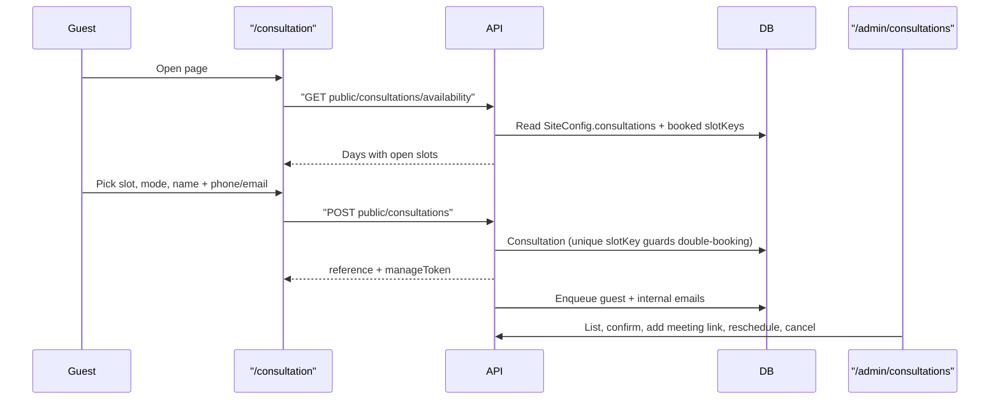

# Platform consultation booking

Guests book a free consultation with the Ceylon Weddings team by picking a real open slot from admin-published availability. Nothing like this exists today: `Appointment` is a couple-owned planner entry vendors can't see, and `Inquiry.preferredDate` is stored but never surfaced.

## Flow



## 1. Data model (`packages/database/prisma/schema.prisma`)

New enums: `ConsultationStatus` (`PENDING`, `CONFIRMED`, `COMPLETED`, `CANCELLED`, `NO_SHOW`), `ConsultationMode` (`VIDEO`, `PHONE`, `WHATSAPP`, `IN_PERSON`), `ConsultationTopic` (`GETTING_STARTED`, `VENDORS`, `BUDGET`, `VENUE`, `PLATFORM_HELP`, `VENDOR_ONBOARDING`, `OTHER`).

`Consultation` model:
- Slot: `startsAt`, `endsAt`, `timezone` (default `Asia/Colombo`), `slotKey String? @unique`
- Guest: `name`, `email String?`, `phone String?`, `locale @default("en")`, `topic`, `mode`, `message String?`, plus optional context `weddingDate`, `city`, `guestCount`, `budgetLkr`
- Links: `userId String?`, `weddingId String?`, `assignedAdminId String?`
- Ops: `status @default(CONFIRMED)`, `reference String @unique` (short human code), `manageToken String @unique`, `meetingUrl String?`, `adminNotes String?`, `confirmedAt`, `cancelledAt`, `cancelReason`, `ip String?`, `source String?`
- Indexes: `@@index([status, startsAt])`, `@@index([startsAt])`, `@@index([email])`

Double-booking is prevented at the DB level by `slotKey @unique` (the slot's ISO start). It is nullable so cancelling sets `slotKey = null` and frees the slot (Postgres unique indexes ignore NULLs). Catch Prisma `P2002` and return 409 "That time was just taken".

Also add `consultations Json?` to the existing single-row `SiteConfig` (currently `branding` / `homepage` / `onboarding`, schema.prisma ~1174).

One migration in `packages/database/prisma/migrations/` created via the root `db:migrate` script.

## 2. Availability settings + slot math (`packages/contracts/src/consultation/`)

New `consultationSettingsSchema` stored in `SiteConfig.consultations`, added to [packages/contracts/src/admin/site-config.ts](packages/contracts/src/admin/site-config.ts) (`siteConfigSchema`, `updateSiteConfigBodySchema`) with a `DEFAULT_CONSULTATION_SETTINGS` export so existing rows keep working:

```ts
{
  enabled: true, timezone: "Asia/Colombo", slotMinutes: 30, bufferMinutes: 0,
  leadTimeHours: 12, horizonDays: 21, maxPerDay: 6, autoConfirm: true,
  modes: ["VIDEO", "PHONE", "WHATSAPP"], defaultMeetingUrl: null,
  weekly: { mon: [{ start: "09:00", end: "17:00" }], /* ...sun: [] */ },
  blackoutDates: [], // "YYYY-MM-DD"
  intro: { title, body, durationNote }
}
```

Pure helper `buildConsultationSlots({ settings, from, bookedKeys, now })` returns days with `{ startsAt, endsAt, slotKey, available }`, applying lead time, horizon, blackout dates, `maxPerDay`, and booked keys. `packages/contracts` has no date dependency, so convert local wall-clock to UTC with a small offset helper using `Intl.DateTimeFormat(tz, { timeZoneName: "longOffset" })` rather than adding `date-fns` (only `packages/ui` has it). Export from `packages/contracts/src/index.ts`.

## 3. API — new module `apps/api/src/modules/consultations/`

`ConsultationsModule` (imports `AuthModule`, `AdminModule` for `AdminAccessService` + `SiteConfigService`, `BullModule.registerQueue({ name: "email" })`), registered in `apps/api/src/app.module.ts`. Controller follows the promotions pattern in [apps/api/src/modules/admin/promotions.controller.ts](apps/api/src/modules/admin/promotions.controller.ts) — `@Controller()` with per-route guards and a local `clientIp(req)` helper.

Public (no guard, gated by feature flag `consultations.public`):
- `GET public/consultations/availability?from=&days=`
- `POST public/consultations` — `@RateLimit({ points: 5, duration: 3600 })` using the existing decorator in [apps/api/src/common/rate-limit.guard.ts](apps/api/src/common/rate-limit.guard.ts). Re-validates the requested slot against published availability server-side (never trusts the client), requires `name` plus at least one of `email` / `phone` via a Zod `.refine`, and best-effort decodes the auth cookie to attach `userId` / `weddingId` when someone is signed in.
- `GET public/consultations/:manageToken` and `POST public/consultations/:manageToken/cancel` (rate-limited)
- `GET public/consultations/:manageToken/calendar.ics` — hand-built VEVENT, `text/calendar`

Admin (`JwtCookieGuard` + `access.assertAdmin`, audit via `access.append({ entityType: "CONSULTATION" })`):
- `GET admin/consultations?status=&mode=&from=&to=&q=` (filter-object style, no pagination — matches `promotionListQuerySchema`)
- `GET admin/consultations/:id`, `POST admin/consultations` (book on behalf of a phone-in), `PATCH admin/consultations/:id` (status, `meetingUrl`, `adminNotes`, `assignedAdminId`, reschedule `startsAt`), `POST admin/consultations/:id/cancel`

Add `consultations.public` (default `true`) to `FEATURE_FLAG_CATALOG` and `featureFlagCatalogKeySchema`, checked with the existing `isFeatureEnabled` util.

## 4. Emails and internal alerting

Add `consultation-confirmed` (guest: reference, local time, mode, meeting link, manage/cancel URL) and `consultation-new` (internal, to `branding.contactEmail`) templates in [apps/api/src/modules/jobs/email.service.ts](apps/api/src/modules/jobs/email.service.ts) and their default subjects in `email.processor.ts`, enqueued via `@InjectQueue("email")`.

Note: `email.service.ts` currently only logs — no SMTP/Resend transport is wired and there are no mail env vars. Emails will render and enqueue correctly but not actually deliver until transport is added; that's a separate task. In-app admin notifications are out of scope since `NotificationType` is `MESSAGE`-only and widening it touches the messaging contracts.

## 5. Public web flow

New `apps/web/src/app/[locale]/consultation/page.tsx` (server component: fetch availability + site config via the pattern in [apps/web/src/lib/public-site.tsx](apps/web/src/lib/public-site.tsx), set metadata, 404/hide when the flag is off) plus `consultation-content.tsx` (client, three steps: day + slot, mode + topic, contact details). Confirmation state shows the reference, the time in `Asia/Colombo`, the meeting link, an "add to calendar" `.ics` link, and the manage link. Slots render from the server response so taken times simply are not offered.

New `apps/web/src/app/[locale]/consultation/[token]/page.tsx` for guests to view or cancel.

Entry points (all flag-gated): `links` in [apps/web/src/components/public-chrome.tsx](apps/web/src/components/public-chrome.tsx) (~line 44), `companyLinks` in the footer (~line 96), and a cross-link from the contact page.

## 6. Admin web UI

- `apps/web/src/app/[locale]/admin/consultations/page.tsx` — list using `PageHeader`, `SectionCard`, `AdminDataTable` / `AdminDataRow` / `AdminDataCell`, copying [apps/web/src/app/[locale]/admin/ads/page.tsx](apps/web/src/app/[locale]/admin/ads/page.tsx); filters for status, mode, date range, and query; upcoming-vs-past split.
- `apps/web/src/app/[locale]/admin/consultations/[id]/page.tsx` — detail with status actions, meeting link, notes, reschedule, cancel.
- `apps/web/src/app/[locale]/admin/settings/consultations/page.tsx` — weekly hours, slot length, lead time, horizon, modes, blackout dates, default meeting link; saved through the existing `PUT /admin/settings/site`. Add a `Consultations` entry to `TABS` in [apps/web/src/app/[locale]/admin/settings/layout.tsx](apps/web/src/app/[locale]/admin/settings/layout.tsx).
- Nav: add `{ href: "/admin/consultations", key: "consultations", icon: CalendarClock }` to `adminGroups` in [apps/web/src/components/dashboard-shell.tsx](apps/web/src/components/dashboard-shell.tsx) (~line 121).

## 7. Client + i18n

- `packages/web/src/api/client.ts`: public `consultations: { availability, book, get, cancel }` near the existing `site:` group (~line 769), and admin methods in the `admin:` object mirroring the promotion CRUD block (~line 711).
- `packages/i18n/src/messages/{en,si,ta}.json`: new `consultation` group for the public flow, plus `nav.consultations` for admin nav. Sinhala and Tamil translated, not copied.

## 8. Last: wire the contact form

[apps/web/src/app/[locale]/contact/contact-content.tsx](apps/web/src/app/%5Blocale%5D/contact/contact-content.tsx) currently just flips local state on submit (line 23) and posts nowhere. Add a small `ContactMessage` model (`name`, `email`, `phone?`, `message`, `status`, `ip`, `createdAt`), a rate-limited `POST public/contact-messages`, and an admin inbox tab alongside consultations, plus a "book a consultation instead" CTA on the contact page. Kept last so it can be dropped without affecting the consultation feature.

## Verification

Run `db:migrate`, rebuild the API (`pnpm --filter @ceylonweddings/api build`) since `pnpm start` serves compiled `dist/main.js`, then check: availability endpoint respects lead time and blackout dates; booking the same slot twice returns 409 and the slot disappears from availability; cancelling frees the slot; the flag off hides nav links and returns 404 on the public routes; `ReadLints` clean.