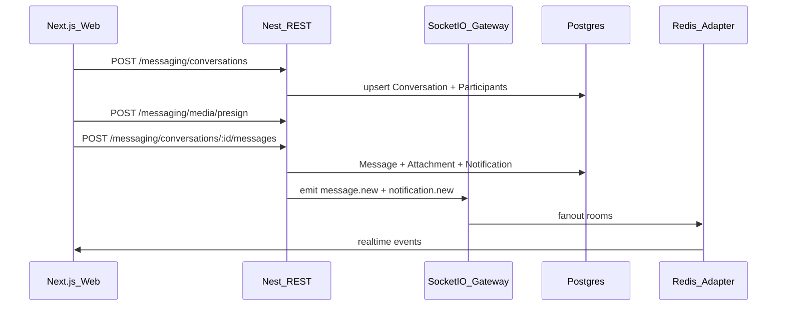

# In-app Direct Messaging (Socket.IO)

## Decisions locked
- **Alongside WhatsApp:** keep `Inquiry` + `wa.me` unchanged; new Messages center is separate.
- **v1 surface:** text + image/file attachments (S3), read receipts, typing indicators, in-app realtime bell/badge for all four pairs. No email/push/FCM in v1.
- **1:1 only** (no group chats). Admin threads use a **shared admin pool** (any `ADMIN` can read/reply; first reply sets `assignedAdminId`).

## Architecture

**Rooms:** auto-join `user:{userId}` on connect; join `conversation:{id}` only after ACL check.

**Authoritative write path:** Nest `MessagingService` used by REST (history, create, send, read, presign) and by gateway handlers (send, typing, read). Socket never bypasses the service.

## Data model ([packages/database/prisma/schema.prisma](packages/database/prisma/schema.prisma))

Add enums/models (no change to `Inquiry`):

- `ConversationType`: `COUPLE_VENDOR | COUPLE_ADMIN | VENDOR_VENDOR | VENDOR_ADMIN`
- `Conversation`: `id`, `type`, optional `weddingId`, optional `vendorId` (couple↔vendor context), optional `assignedAdminId`, `lastMessageAt`, `createdAt`
- `ConversationParticipant`: `conversationId`, `userId`, `lastReadAt`, `muted` — `@@unique([conversationId, userId])`
- `Message`: `id`, `conversationId`, `senderId`, `body` (nullable if attachment-only), `createdAt`, `editedAt?`, `deletedAt?`
- `MessageAttachment`: `id`, `messageId`, `url`, `key`, `contentType`, `filename`, `byteSize`
- `Notification`: `id`, `userId`, `type` (`MESSAGE` | …), `title`, `body`, `href?`, `conversationId?`, `messageId?`, `readAt?`, `createdAt`

**Pair uniqueness:** for non-admin types, deterministic `pairKey` = `sorted(userA,userB)+type` unique index so re-open returns the same thread. Admin-pool threads: `pairKey` = `initiatorId+type`.

**Start rules (ACL):**
- `COUPLE_VENDOR`: couple (wedding member) ↔ vendor owner; optional `weddingId` stored
- `VENDOR_VENDOR`: both users must be `VENDOR` with linked `Vendor`
- `COUPLE_ADMIN` / `VENDOR_ADMIN`: initiator role matches; any `ADMIN` may access; non-admins must be participants

## Backend ([apps/api](apps/api))

New module `modules/messaging/`:
- `messaging.module.ts`, `messaging.service.ts`, `messaging.controller.ts`
- Wire into `RealtimeModule` / inject gateway emitter (or thin `RealtimeEmitter` provider)

**REST** (cookie JWT via existing `JwtCookieGuard`):
- `GET /messaging/conversations` — inbox (last message preview, unread count)
- `POST /messaging/conversations` — open/create by peer + type
- `GET /messaging/conversations/:id/messages?cursor=` — paginated history
- `POST /messaging/conversations/:id/messages` — send text + attachment refs
- `POST /messaging/conversations/:id/read` — update `lastReadAt`, emit `message.read`
- `POST /messaging/media/presign` — generalize S3 keys under `messages/{conversationId}/…` (extend pattern from [media.service.ts](apps/api/src/modules/weddings/media.service.ts); allow images + pdf; size/type allowlist in contracts)
- `GET /messaging/notifications`, `POST /messaging/notifications/read`

**Socket auth** — extend [realtime.gateway.ts](apps/api/src/modules/realtime/realtime.gateway.ts):
- On `handleConnection`: parse `cw_access` from handshake cookies (same cookie helper as HTTP), verify JWT, load user, set `socket.data.user`, join `user:{id}`; disconnect if invalid
- Events: `conversation.join` / `leave` (ACL), `message.send` (ack), `typing.start` / `typing.stop`, `message.read`
- Server emits: `message.new`, `message.read`, `typing.update`, `notification.new`, `conversation.updated`
- Keep existing `join.wedding` but require auth + wedding membership check (harden while touching gateway)

Reuse Redis adapter already in [realtime.adapter.ts](apps/api/src/realtime.adapter.ts) for multi-instance fanout.

## Contracts ([packages/contracts](packages/contracts))

New `packages/contracts/src/messaging/` Zod schemas: conversation, message, attachment, notification, create/send/presign bodies, list responses. Export from [packages/contracts/src/index.ts](packages/contracts/src/index.ts).

## Web client ([packages/web](packages/web))

- Extend [client.ts](packages/web/src/api/client.ts) with `api.messaging.*`
- Upgrade [realtime.ts](packages/web/src/api/realtime.ts): connect when authed, reconnect, typed event helpers
- Zustand `useMessagingStore`: unread totals, active conversation id, optimistic send queue, notification list

## UI

**Domain kit** in `packages/ui/src/domain/messages-studio.tsx`:
- Split inbox list + thread pane (desktop); list→thread on mobile
- Composer: text, attach (presign→PUT→send), typing indicator, read state
- Match existing domain patterns (`offer-studio`, shell chrome) — no generic card-dashboard clutter

**Routes:**
- `[locale]/planning/messages` (couple/family)
- `[locale]/pro/messages` (vendor)
- `[locale]/admin/messages` (admin pool inbox)

**Shell** — update [shell-trail.tsx](apps/web/src/components/shell-trail.tsx):
- Messages popover: **DM unread preview** + link to Messages page; keep WhatsApp inquiries as a secondary “Leads / WhatsApp” section when role is couple
- Notifications popover: driven by `Notification` rows + live `notification.new` (badge count)
- Enable `messages` trail on pro/admin shells as well as planning

**i18n:** EN/SI/TA keys for inbox empty states, typing, attach errors, admin pool labels.

## Security / prod hardening
- Every conversation join/send/read: participant or admin-pool ACL
- Rate-limit message send (simple per-user token bucket in service or existing throttler if present)
- Attachment allowlist + max size; never trust client `publicUrl` without matching conversation-scoped key prefix
- Soft-delete messages (`deletedAt`); recipients see tombstone
- Cookie WS: `withCredentials` already set; document `COOKIE_DOMAIN` / `COOKIE_SECURE` for cross-subdomain prod

## Out of scope (v1)
- Replacing or auto-converting Inquiries to threads
- Email/SMS/push delivery
- Group chats, voice/video
- Message search / reactions / threads-within-threads
