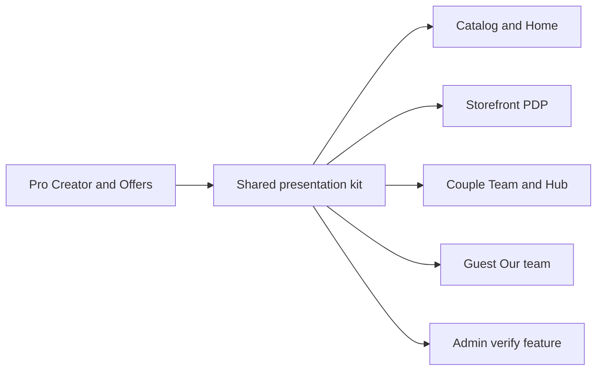

# Vendor Creator + Immersive Presentation System

## Selling-point thesis

CeylonWeddings wins later not on “another vendor directory,” but on **how unbeatable vendors look and how decisive booking feels**:

> Couples: “These people already look like *our* wedding.”  
> Vendors: “Nowhere else makes my work look this expensive.”

That requires **two tracks in parallel**:

1. **Creator / Offers** — vendors can fully express how they sell  
2. **Presentation system** — the same rich data renders immersively on catalog, storefront, couple team, guest site, and admin

Creator without presentation = unused fields. Presentation without creator = seed theater forever.



---

## Track A — Creator + Offers (unchanged core)

Deep audit: packages are seed-only; `GET /vendors/me` strips packages; Pro edits 7 fields while couples see packages/FAQs/gallery/inclusions.

### Offer model (this pass)

**Vendor framing:** `offerHeadline`, `startingPriceLkr` + `priceDisplayMode` (`FIXED`|`FROM`|`ON_REQUEST`), `typicalSpendLkr`, `includedInPrice[]`, tax/deposit/cancellation notes, `serviceAreas[]`, `travelNote`, editable years/couples served.

**Packages:** custom `name` (tier optional badge only), `status` draft/published, `sortOrder`, `badge` Popular/Best value/Limited, `pricingMode` FIXED|FROM|RANGE|PER_GUEST|ON_REQUEST, price min/max, inclusions/exclusions, `eventTypes[]`, duration/guests, 1–3 `photoUrls`, `bestFor`, reusable **add-ons**.

**Pro studio:** Basics · Media · **Offers** · Presence · FAQs · Publish; live preview reuses public presentation modules.

**API:** stop stripping packages on `/me`; expand PATCH; package/add-on upsert; completeness helper; sync min published package → `startingPriceLkr` on save.

---

## Track B — Immersive presentation across surfaces

### Current state (audit)

| Surface | Today | Immersive gap |
|---------|-------|---------------|
| Catalog `/vendors` + home | Triptych [`VendorCard`](packages/ui/src/domain/vendor-card.tsx), filters, featured grid | No shortlist, no hover CTA, flat home strip, no quality bar |
| Storefront `/vendors/[slug]` | 3-up grid, tabs, inquire + WhatsApp, packages read-only | No gallery theater, sticky mobile CTA, socials unused, no shortlist |
| Couple `/planning/team` + hub | Text status list; hub photo tiles without names | Not a visual wedding board; no shortlist CTA anywhere |
| Guest `/w/[slug]` | Events/FAQ/RSVP only | Vendors invisible — missed prestige loop |
| Admin `/admin/vendors` | Name + verify/feature toggles | No public preview; “Feature” doesn’t mean “looks unbeatable” |
| Pro `/pro` | Thin form + lead counts | Cannot maintain what public shows |

### Shared presentation kit (`packages/ui` domain)

One visual language (Cormorant titles, pearl/temple/night, full-bleed photo planes, gold CTAs). Apps compose; do not invent parallel card languages.

| Module | Job | Surfaces |
|--------|-----|----------|
| `MediaFrame` | Aspect-locked photo, blur-up, corner trust marks | All |
| `VendorIdentity` | Serif name + city + category + trust chips | Card, PDP, team, guest, admin |
| `TrustMarks` | Verified / Featured / destination | All |
| `VendorTriptychCard` | Evolve current card — 3 distinct shots + price/category + heart | Catalog, home |
| `VendorGallery` | Hero + thumbs; lightbox next | Storefront, Pro preview |
| `PackageCompare` | Side-by-side packages + inclusion matrix | Storefront, Pro preview, later compare tray |
| `InquirePanel` | Sticky WhatsApp primary + quote secondary | Storefront |
| `ShortlistControl` | Heart → `SHORTLISTED` | Catalog, storefront |
| `TeamMemberCard` / `SupplierStrip` | Photo + status board | Hub, `/planning/team` |
| `GuestVendorCredit` | Tasteful credit, no prices | Guest site when `BOOKED` |
| `AdminListingPreview` | Mini public card/storefront | Admin queue |

### Progressive disclosure (conversion spine)

```
Catalog card → Storefront → Commit → Prestige
3 photos     → Gallery + packages → WhatsApp / shortlist → Guest Our team
Price band   → Compare offers     → Team status board    → Vendor goodwill SEO
```

Rules:
- Grid never opens inquire modal — open storefront  
- First storefront viewport = gallery + identity + sticky inquire only (packages/FAQs below)  
- Max ~4 packages visible + “Request custom quote”  
- Quiet motion only (gallery fade, sticky bar, heart) — not SaaS dashboard chrome  

### Surface specs (prod-scale)

**1. Catalog + home**  
Photography-first grid; shortlist heart; featured home strip uses same card; price label from `priceDisplayMode`; keep category pills + facets. Map later (venues).

**2. Storefront (PDP)**  
Gallery-first split; sticky `InquirePanel` (desktop right / mobile bottom); `PackageCompare`; socials; inquire prefills selected package; soft “Save to team.”

**3. Couple (clients)**  
Shortlist as first-class API + UI; `/planning/team` = visual `TeamMemberCard` board by status; hub `SupplierStrip`; optional couple-chrome banner on catalog for team gaps. Compare tray of 2–3 same-category shortlisted vendors = next wave.

**4. Guest**  
Opt-in “Our team” for `BOOKED` vendors via `GuestVendorCredit` (photo + role + name + soft “View on CeylonWeddings”). No prices, no inquire spam. Prestige loop = free vendor advertising.

**5. Admin**  
Queue shows `AdminListingPreview` mirroring public card; verify/feature with **presentation quality gate** (min distinct photos, description, WhatsApp, ≥1 offer path). Feature = homepage/sort boost with editorial taste, not a blind boolean.

---

## Competitive moat (why this is the selling point)

| | Bridengroom | Knot | CeylonWeddings |
|---|-------------|------|----------------|
| Catalog | Directory breadth | US scale | Curated photography + SL taxonomy |
| Storefront | Text/package blobs | Strong packages | Immersive gallery + WhatsApp-native |
| Planning | Tools | Deep US planning | Visual team board tied to marketplace |
| Guest | Sites | Templates | Booked vendor credits = prestige loop |
| Trust | Reviews claim | Awards | Verify/feature as **editorial quality bar** |

Moat formula: **media quality bar + continuous team narrative + WhatsApp conversion + guest-site prestige**.

---

## Implementation waves (concrete)

### Wave 1 — Creator + presentation MVP (this plan)

1. Offer schema + API unlock (`/me` packages, PATCH framing, package/add-on upsert, shortlist endpoint)  
2. Shared presentation kit modules  
3. Pro storefront studio (Offers-rich) with preview = public modules  
4. Catalog card + home strip refresh; storefront gallery/split + InquirePanel + PackageCompare + socials  
5. Shortlist + visual `/planning/team` + hub `SupplierStrip`  
6. Admin listing preview + quality gate for feature  

### Wave 2 — Conviction (done)

- Gallery lightbox; couple compare tray on `/planning/team`; guest Our team; light motion; homepage featured only passes quality gate; public package add-ons  

### Wave 3 — Moat polish (done, no PayHere/CDN yet)

- Ceylon Picks editorial branding + admin Make Pick
- Catalog map-list discovery by district + Google Maps deep-links
- REAL_WEDDING articles with `vendorSlugs` + Ideas credits + storefront “As seen in”
- Category-aware cinematic gallery ratios; overtime note on vendor  

---

## Success criteria

**Creator:** vendors publish full offers without seeds; every couple-visible field editable (except admin badges).  

**Presentation:** same vendor looks premium on catalog → PDP → team → guest → admin preview.  

**Selling point test:** a strong photographer should say Bridengroom looks like a directory row; CeylonWeddings looks like a brand — and a couple can go see three frames → fall into gallery → WhatsApp → save to team → guests later see that name under Our team.
