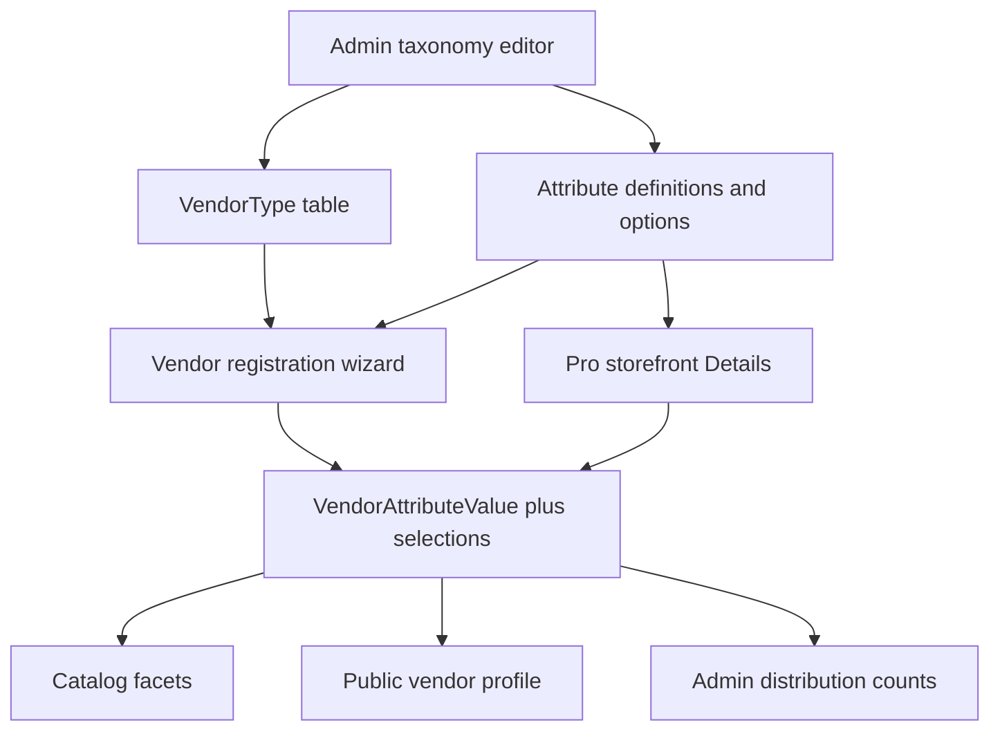
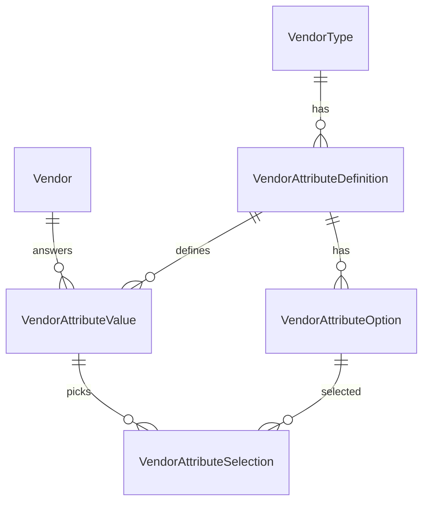

# Admin-managed vendor types and attributes

## What exists today

Marketplace vendors are one-size-fits-all. Core listing fields in [`packages/database/prisma/schema.prisma`](packages/database/prisma/schema.prisma) (`name`, `city`, `startingPriceLkr`, packages, media, `styles: String[]`, `destinationExperienced`) are solid and stay as **first-class columns**.

Gaps:

- `VendorCategory` is a Prisma **enum** (20 values). Adding DJ requires a migration, contract change, and label updates in [`packages/contracts/src/vendor/enums.ts`](packages/contracts/src/vendor/enums.ts), [`apps/web/src/lib/labels.ts`](apps/web/src/lib/labels.ts), homepage, awards, promotions, offer templates.
- The only “style” field is a free-tag `String[]`. It cannot power reliable filters or analytics.
- Catalog filters in [`apps/api/src/modules/weddings/vendors.service.ts`](apps/api/src/modules/weddings/vendors.service.ts) are city, district, price, rating, featured, verified, destination — not “shoots film” or “drone”.
- Vendor signup is account-only ([`apps/web/src/app/[locale]/register/page.tsx`](apps/web/src/app/[locale]/register/page.tsx)); `GET /vendors/me` auto-creates a `PHOTO_VIDEO` shell. There is no category-specific onboarding. Editing happens in a long studio form at [`/pro/storefront`](apps/web/src/app/[locale]/pro/storefront/page.tsx).

Labels, questions, and options must live in the **database** (with EN/SI/TA), not `en.json`, so admin edits ship without deploys.

## Architecture

Two layers, one renderer:

Keep existing Vendor columns for marketplace mechanics (price, city, moderation, packages). Put **type-specific questions** in the attribute system. Do not stuff filterable data into a JSON blob on `Vendor` — that breaks faceted search and `GROUP BY` analytics.

## 1. Replace the category enum with `VendorType`

Create `VendorType` (name avoids clashing with the existing enum during migration):

- `slug` — public API key, **immutable after create**. Seed existing enum strings (`PHOTO_VIDEO`, `VENUE`, …) so `/vendors?category=PHOTO_VIDEO` does not break.
- `label` / `description` as `{ en, si, ta }` JSON
- `icon`, `coverUrl` (wizard picker cards)
- `sortOrder`, `featured` (catalog primary chips; replaces hardcoded `PRIMARY` in [`vendors-catalog.tsx`](apps/web/src/app/[locale]/vendors/vendors-catalog.tsx))
- `coreTeam` (replaces `CORE_TEAM_CATEGORIES` in [`packages/contracts/src/wedding/helpers.ts`](packages/contracts/src/wedding/helpers.ts))
- `status`: `DRAFT | ACTIVE | HIDDEN | ARCHIVED`
- Soft-hide only if vendors exist; hard-delete only when vendor count is 0

**Vendor.category** becomes `categoryId` FK. Serialized API still exposes `category: slug` (string). Make `categoryId` **nullable during onboarding**; catalog/public continue to exclude uncategorized or hidden listings.

Other enum usages to migrate in the same Prisma migration:

- [`FeaturedPlacement.category`](packages/database/prisma/schema.prisma)
- [`AwardNomination.category`](packages/database/prisma/schema.prisma)
- [`Promotion.categories VendorCategory[]`](packages/database/prisma/schema.prisma) → `String[]` of slugs (same shape, validated against `VendorType`)

**Contracts:** [`vendorCategorySchema`](packages/contracts/src/vendor/enums.ts) stops being a 20-value `z.enum`. It becomes a slug string (`/^[A-Z][A-Z0-9_]{1,47}$/` plus runtime “exists and ACTIVE” checks in Nest). Every `vendorCategorySchema.options` call site (storefront select, catalog chips, admin ads, site homepage `categoryKeys`) switches to `GET /vendor-types`.

**Guards:** cannot change slug; renaming is label-only. Archiving hides from catalog/wizard but keeps historical vendors.

## 2. Attribute schema (filter- and analytics-grade)

**Definition** (admin-owned, per type; `typeId` null = global, e.g. destination):

- `key` immutable (`formats`, `style`, `services`) — unique per type
- `valueType`: `SELECT | MULTISELECT | BOOLEAN | NUMBER | RANGE | TEXT`
- Localized `question`, `instruction` (“Select all that apply”), `helpText` (“Why we ask”)
- `required`, `filterable`, `showOnProfile`, `collectOnboard`
- `layout`: `CARDS | GRID | LIST | TOGGLE | SLIDER | TEXT` (drives wizard chrome, not a different data type)
- `groupKey` + `groupLabel` (wizard sections: Details, Style, Capacity)
- `unit`, `minValue`, `maxValue`, `maxSelect`
- `status`: draft / active / archived
- **Cannot change `valueType` once any vendor has a value**

**Option:** stable `key` (`digital`, `film`), localized label, `sortOrder`, `active`. Never hard-delete if selected; archive so historical values and analytics stay valid.

**Value storage (not JSON):**

- `VendorAttributeValue`: one row per vendor+definition — `booleanValue`, `numberValue`, `rangeMin`/`rangeMax`, `textValue`
- `VendorAttributeSelection`: `(vendorId, optionId)` junction with indexes on `optionId` — this is what catalog `AND` filters and admin “how many shoot film?” queries use

TEXT is never filterable. SELECT/MULTISELECT/BOOLEAN/RANGE/NUMBER default `filterable: true`.

Keep existing `Vendor.styles` and `destinationExperienced` for now; hide the free-tag Styles input when the type has a `style` attribute. No automatic data migration of tags.

## 3. APIs and contracts

New module [`packages/contracts/src/vendor/attributes.ts`](packages/contracts/src/vendor/attributes.ts), Nest services under `apps/api/src/modules/vendors/` (split from the oversized [`vendors.service.ts`](apps/api/src/modules/weddings/vendors.service.ts) if it stays readable; otherwise a dedicated `vendor-taxonomy` module).

**Public**

- `GET /vendor-types` — active types + filterable definitions/options (catalog + homepage)
- `GET /vendor-types/:slug/schema` — full onboard schema for the wizard

**Vendor**

- Stop auto-assigning `PHOTO_VIDEO` in `mine()`
- `GET /vendors/me/onboarding` — schema for current type + saved values + `complete`
- `PATCH /vendors/me` — set `category` slug (clears values that do not apply to the new type)
- `PUT /vendors/me/attributes` — upsert values; server validates against live definitions (unknown keys rejected, archived options ignored, required checked on complete)

**Admin** (`MANAGE_SETTINGS`, audit via existing [`AdminAccessService.append`](apps/api/src/modules/admin/admin-access.service.ts))

- CRUD types, reorder, hide
- Nested CRUD definitions + options (including EN/SI/TA copy)
- `GET /admin/vendor-types/:id/analytics` — counts per option / boolean / numeric bucket

**Catalog** ([`vendorCatalogQuerySchema`](packages/contracts/src/vendor/vendor.ts)): add `attrs` as `Record<string, string | string[] | { min?: number; max?: number }>`. Extend [`toSearchParams` / `parseSearchParams`](packages/contracts/src/query.ts) — today `Object.fromEntries` **drops duplicate keys**, which cannot represent `a.formats=digital&a.formats=film`. Use `a.<key>` query keys.

Filter logic: category required before attribute filters apply. MULTISELECT uses `hasSome` on the junction (`OR` within one attribute, `AND` across attributes). RANGE: couple min capacity → `rangeMax >= min`.

Facet counts: when `category` is set, return `facets.attributes[]` alongside cities/districts.

## 4. Admin UI

New settings tab **Categories** next to Site/Pages/Flags in [`apps/web/src/app/[locale]/admin/settings/layout.tsx`](apps/web/src/app/[locale]/admin/settings/layout.tsx):

- Type list: drag reorder, featured/core toggles, cover image, localized name, hide
- Type detail: attribute list with type badges, required/filterable flags, drag reorder, “add question”
- Question editor: value type, layout, group, copy in EN/SI/TA, options table (add/reorder/archive), live **preview** of the vendor card UI
- Inline analytics strip: option distribution for that type

Homepage `categoryKeys` editor ([`admin/settings/site`](apps/web/src/app/[locale]/admin/settings/site/page.tsx)) loads types from the API instead of a hardcoded array.

## 5. Vendor registration wizard (not a boring form)

Account register stays as-is. After `role=VENDOR`, send them to **`/pro/onboard`** (not `/pro`) until `onboardingCompletedAt` is set. Gate [`/pro`](apps/web/src/app/[locale]/pro/page.tsx) and storefront with the same check.

Wizard UX (schema-driven, Zola interaction, CeylonWeddings visual language — serif questions, pearl cards, not black-pill clones):

1. **What do you do?** — large image/icon cards for active types, not a dropdown
2. Then one **question per step** (or one `groupKey` page), URL like `/pro/onboard?step=formats`
3. SELECT → radio cards; MULTISELECT → checkbox cards / grid; BOOLEAN → two big yes/no cards; RANGE → dual slider with unit; TEXT → single short field
4. Top stepper from admin groups (Profile → Details → …); Back; primary **Continue**; optional **Why we ask**
5. Autosave each step so Back never loses work
6. Optional questions can skip; required block Continue
7. Finish → `/pro/storefront`

Shared renderer in [`packages/ui`](packages/ui/src) (`ChoiceCard`, `AttributeField`, `OnboardWizard`) so `/pro/storefront` gets a **Details** section that is the same components in stacked form (edit anytime), not a second implementation.

Completeness in [`vendorCompleteness`](packages/contracts/src/vendor/vendor.ts) gains `category` + required attributes.

## 6. Catalog, profile, analytics

- Catalog: after a type is selected, render dynamic facets from definitions (`filterable`)
- Public PDP ([`vendors/[slug]`](apps/web/src/app/[locale]/vendors/[slug]/page.tsx)): grouped chips (Style, Formats, Services) instead of raw `styles.join`
- Compare page: include selected attributes when both vendors share a type
- Admin analytics endpoint is enough for v1 (no new BI tool). Couple-facing “analytics” **is** faceted filter + counts

## 7. Seed so PHOTO_VIDEO is real on day one

Seed all 20 current types with existing slugs/labels. Seed photographer definitions matching the intended vendor UX:

- `formats` MULTISELECT CARDS — Digital, Film, Hybrid
- `services` MULTISELECT GRID — Bride-only session, Drone, Engagement, Extra hours, Image editing, Online proofing, Printing rights, Same-day edits, Second photographer
- `style` SELECT CARDS — Classic, Editorial, Fine Art, Photojournalistic

Plus a small VENUE set (`guestCapacity` RANGE, `outdoor` BOOLEAN) so a second type is proven. Other types start empty for admin to fill. Offer templates in [`offer-templates.ts`](apps/web/src/lib/offer-templates.ts) stay keyed by slug for known types; unknown types get no templates.

## Production rules (do not skip)

- Validate values against the **current** definition, not client-sent type
- Archive > delete for options and types
- Audit log every taxonomy mutation
- Localized copy with `en` fallback
- Index: `Vendor(categoryId)`, `VendorAttributeSelection(optionId, vendorId)`, `VendorAttributeValue(definitionId, booleanValue)`, range columns
- Do not put filterable values only in JSON
- Conditional attributes (“show drone hours if drone”) are **out of v1**

## Out of scope for this pass

- Elasticsearch / full-text on attributes
- Conditional / branching questions
- Per-vendor custom fields (only admin-defined)
- Migrating `styles[]` history
- Admin-defined package templates on the type
- Changing couple register flow
