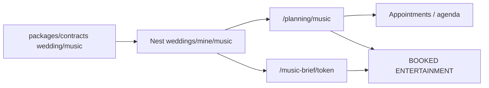

# Wedding Music Planner — Contract-First Product

## Selling-point thesis

Agenda already answers *when*. Music answers *what plays when* — the #1 day-of fight between couple, parents, and DJ.

> Couples: “Poruwa has magul bera cues; reception has Baila + do-not-play Amma’s list.”  
> DJs/bands: “One brief link — must-plays, banned tracks, timed cues. Done.”

**Same playbook as Couple Event Studio / Messaging:** contracts own shapes + pure logic; Nest is thin; UI renders.



---

## Decisions locked (v1)

| Decision | Choice |
|----------|--------|
| Scope unit | **One `MusicPlan` per `Event`** (poruwa ≠ reception ≠ homecoming) |
| Track lists | `MUST` \| `MAYBE` \| `DO_NOT` only (no guest REQUEST yet) |
| Cue model | Timed cues on the plan; **optional** `appointmentId` soft-link to DAY_OF agenda |
| Media | Title + artist + optional URL string (YouTube/Spotify paste). **No OAuth, no embed player product** |
| Share | Opaque `shareToken` → public **read-only** brief. Optional “Send via DM” to BOOKED ENTERTAINMENT |
| Auth write | Couple (wedding owner members with Role COUPLE) — same bar as events/profile |
| Auth read (mine) | Any wedding member |
| Auth brief | Token only; no PII beyond track titles / cue labels |
| Templates | Contract helper `musicCueTemplatesForEventKind(kind)` — seed cues, not hard-coded in UI |
| i18n | EN / SI / TA strings for chrome + empty states |
| Out of v1 | Guest song requests, Spotify API metadata, AI set-lists, PDF binary export, realtime collab |

**Deferred (explicit):** guest REQUEST approve-flow; Spotify/YouTube oEmbed; AI suggestions; PDF generation; family `canManageMusic` flag.

---

## Architecture rule (non-negotiable)

All product shapes and pure logic live in `@ceylonweddings/contracts`:

- Zod request/response schemas + enums  
- `musicCueTemplatesForEventKind`, `musicPlanSummary`, `buildMusicBrief`, `musicCompleteness`  
- Presentation DTO for hub / brief

Nest = thin `createZodDto` + Prisma + serialize to contract shapes.  
`packages/ui` = renderers only (no list math, no template tables).  
`packages/web` `api.wedding.*` = Zod-parse every response.

---

## Data model ([packages/database/prisma/schema.prisma](packages/database/prisma/schema.prisma))

```prisma
enum MusicListKind {
  MUST
  MAYBE
  DO_NOT
}

enum MusicCueKind {
  PROCESSIONAL
  ENTRANCE
  CEREMONY
  RECESSIONAL
  COCKTAIL
  FIRST_DANCE
  PARENT_DANCE
  CAKE
  BOUQUET
  PARTY
  LAST_DANCE
  TRADITIONAL
  CUSTOM
}

enum MusicLanguage {
  SINHALA
  TAMIL
  ENGLISH
  HINDI
  MIXED
  OTHER
}

enum MusicVibe {
  TRADITIONAL
  ROMANTIC
  UPBEAT
  BAILA
  RELIGIOUS
  SOFT
  PARTY
  CUSTOM
}

model MusicPlan {
  id              String   @id @default(cuid())
  weddingId       String
  wedding         Wedding  @relation(...)
  eventId         String   @unique
  event           Event    @relation(...)
  notes           String?
  vibePrimary     MusicVibe?
  languages       MusicLanguage[]
  entertainmentVendorId String?
  entertainmentVendor   Vendor? @relation(...)
  shareToken      String?  @unique
  shareEnabled    Boolean  @default(false)
  createdAt       DateTime @default(now())
  updatedAt       DateTime @updatedAt
  tracks          MusicTrack[]
  cues            MusicCue[]

  @@index([weddingId])
}

model MusicTrack {
  id          String        @id @default(cuid())
  planId      String
  plan        MusicPlan     @relation(...)
  list        MusicListKind
  title       String
  artist      String?
  url         String?
  language    MusicLanguage?
  vibe        MusicVibe?
  notes       String?
  sortOrder   Int           @default(0)
  createdAt   DateTime      @default(now())
  updatedAt   DateTime      @updatedAt

  @@index([planId, list, sortOrder])
}

model MusicCue {
  id             String       @id @default(cuid())
  planId         String
  plan           MusicPlan    @relation(...)
  kind           MusicCueKind @default(CUSTOM)
  label          String
  trackTitle     String?      // denormalized cue song; optional link to MusicTrack later
  trackId        String?
  track          MusicTrack?  @relation(...)
  appointmentId  String?      // soft link to agenda block
  appointment    Appointment? @relation(...)
  offsetMinutes  Int?         // relative to event.startsAt / nekathAt
  startsAt       DateTime?    // absolute override when set
  durationMinutes Int?
  notes          String?
  sortOrder      Int          @default(0)
  createdAt      DateTime     @default(now())
  updatedAt      DateTime     @updatedAt

  @@index([planId, sortOrder])
}
```

**Rules:**
- Creating a plan for an event that already has one → return existing (idempotent upsert by `eventId`).
- Deleting an `Event` cascades plan (or SetNull — prefer Cascade with Event).
- `appointmentId` SetNull on appointment delete — never block agenda edits.
- `shareToken` generated only when `shareEnabled` flips true; rotating token invalidates old links.

---

## Contracts ([packages/contracts/src/wedding/music.ts](packages/contracts/src/wedding/music.ts))

### Enums / schemas
- `musicListKindSchema`, `musicCueKindSchema`, `musicLanguageSchema`, `musicVibeSchema`
- `musicTrackSchema`, `createMusicTrackBodySchema`, `updateMusicTrackBodySchema`, `reorderMusicTracksBodySchema`
- `musicCueSchema`, `createMusicCueBodySchema`, `updateMusicCueBodySchema`, `reorderMusicCuesBodySchema`
- `musicPlanSchema` (includes tracks + cues arrays or summary counts)
- `upsertMusicPlanBodySchema` (notes, vibe, languages, entertainmentVendorId)
- `musicBriefSchema` (public DTO — no wedding member PII)
- `musicPlanSummarySchema` for hub (`mustCount`, `doNotCount`, `cueCount`, `shareEnabled`, `ready`)

### Helpers (pure)
- `musicCueTemplatesForEventKind(kind: EventKind)` — mirrors `nekathAppointmentSpecs`
  - `PORUWA`: TRADITIONAL / ENTRANCE / CEREMONY (magul bera, ashtaka window, recessional)
  - `CHURCH`: PROCESSIONAL / CEREMONY / RECESSIONAL / FIRST_DANCE
  - `NIKAH` / `WALIMA`: CEREMONY + PARTY soft presets
  - `RECEPTION` / `HOMECOMING`: COCKTAIL → FIRST_DANCE → PARTY → LAST_DANCE
  - `MEHNDI` / `ENGAGEMENT`: UPBEAT party block
- `resolveCueStartsAt(cue, event)` — absolute from `startsAt` or `offsetMinutes` + `event.nekathAt ?? event.startsAt`
- `musicTracksByList(tracks)` / `orderedMusicCues(cues, event)`
- `buildMusicBrief(plan, event, tracks, cues)` — vendor-facing projection
- `musicPlanReady(summary)` — e.g. ≥1 MUST or ≥3 cues
- Extend `weddingCompleteness` with optional `musicPlans` check (at least one event has a ready plan)

Export from [packages/contracts/src/wedding/index.ts](packages/contracts/src/wedding/index.ts) and enums file as needed.

---

## Backend ([apps/api](apps/api))

Prefer **service inside weddings module** (same as appointments/seating) unless file size blows up — then `music.service.ts` + routes on `weddings.controller.ts`.

**REST** (cookie JWT via existing guards):

| Method | Path | Notes |
|--------|------|-------|
| GET | `/weddings/mine/music` | All plans for wedding (summary or full) |
| POST | `/weddings/mine/music` | Upsert plan `{ eventId, ... }` |
| GET | `/weddings/mine/music/:planId` | Full plan + tracks + cues |
| PATCH | `/weddings/mine/music/:planId` | Settings |
| POST | `/weddings/mine/music/:planId/tracks` | Add track |
| PATCH | `/weddings/mine/music/:planId/tracks/:trackId` | Update |
| DELETE | `/weddings/mine/music/:planId/tracks/:trackId` | Delete |
| POST | `/weddings/mine/music/:planId/tracks/reorder` | `{ orderedIds }` |
| POST | `/weddings/mine/music/:planId/cues` | Add cue |
| PATCH | `/weddings/mine/music/:planId/cues/:cueId` | Update |
| DELETE | `/weddings/mine/music/:planId/cues/:cueId` | Delete |
| POST | `/weddings/mine/music/:planId/cues/reorder` | `{ orderedIds }` |
| POST | `/weddings/mine/music/:planId/cues/seed-templates` | Apply contract templates (skip if cues exist unless `replace: true`) |
| POST | `/weddings/mine/music/:planId/share` | `{ enabled }` → mint/rotate/disable token |
| GET | `/public/music-brief/:token` | No auth; returns `musicBriefSchema` |

**ACL:** resolve wedding membership; writes require COUPLE role on membership (match events). Public brief: `shareEnabled && token match` only.

**Serialize:** map Date → ISO strings; never leak `shareToken` on non-owner responses except in couple share panel.

**DTO:** `createZodDto` in `wedding.dto.ts` from contract schemas.

---

## Web client ([packages/web/src/api/client.ts](packages/web/src/api/client.ts))

```ts
api.wedding.musicPlans()
api.wedding.upsertMusicPlan(body)
api.wedding.musicPlan(planId)
api.wedding.updateMusicPlan(planId, body)
api.wedding.createMusicTrack / updateMusicTrack / deleteMusicTrack / reorderMusicTracks
api.wedding.createMusicCue / updateMusicCue / deleteMusicCue / reorderMusicCues
api.wedding.seedMusicCueTemplates(planId, { replace? })
api.wedding.setMusicShare(planId, { enabled })
api.public.musicBrief(token)  // or api.wedding.publicMusicBrief
```

Every method: `schema.parse(await request(...))`.

---

## UI

### Couple — `/planning/music`
- Event switcher (reuse studio/agenda pattern)
- Empty → upsert plan + “Seed ceremony cues” CTA
- Three list columns/sections: Must / Maybe / Do not play
- Cue timeline (sorted via `orderedMusicCues`) with optional link to agenda appointment
- Share panel: enable link, copy URL, “Message BOOKED entertainment” (open/create DM with brief URL body — reuse messaging)
- Entertainment vendor picker from `team` where `category === ENTERTAINMENT` && BOOKED

### Public brief — `/music-brief/[token]`
- Read-only: event name/date, vibe/languages, cue timeline, must / do-not lists
- Minimal chrome; no edit; no guest PII
- Print-friendly CSS (browser print = PDF for v1)

### Shell / hub
- Nav item under planning (near agenda): Music
- Hub completeness / checklist touchpoint once helpers land

### i18n
- Keys under `planning.music.*` in EN/SI/TA

---

## Integration points (do not reinvent)

| Existing | Use |
|----------|-----|
| `Event` / `EventKind` | Plan scope + templates |
| `Appointment` + `agendaForEvent` | Optional cue ↔ day-of block |
| `WeddingVendor` ENTERTAINMENT BOOKED | Vendor picker + DM target |
| Messaging | Send brief URL as message body |
| `weddingCompleteness` / hub | Readiness signal |
| Budget category `music` | Unchanged; optional deep-link later |

---

## Test / acceptance

1. Upsert plan for PORUWA + RECEPTION independently  
2. Seed templates produce distinct cue sets per `EventKind`  
3. Reorder tracks/cues persists  
4. Share off → 404 on brief; share on → brief matches contract schema  
5. Rotate token → old URL 404  
6. FAMILY member can GET plans, cannot POST tracks (403)  
7. Client rejects malformed API payloads via Zod  
8. Deleting agenda appointment nulls cue link without deleting cue  

---

## Implementation order

1. **contracts-music** — schemas + helpers (unblocks everything)  
2. **prisma-music** — migration  
3. **api-music** — REST + public brief  
4. **client-music** — typed client  
5. **ui-music** — planning page + nav + i18n  
6. **brief-surface** — public page + DM hook  
7. **completeness-hub** — readiness wiring  

---

## Open confirmations (defaults if you ship as-is)

1. **v1 scope** = timeline cues + MUST/MAYBE/DO_NOT + shareable brief (+ DM link). Guest requests / Spotify / AI = later.  
2. **Vendor receive** = tokenized brief URL + optional in-app DM; browser print for PDF.  
3. **Write ACL** = COUPLE only (not FAMILY), matching events/studio.

Say the word to implement from this plan, or adjust any locked decision first.
